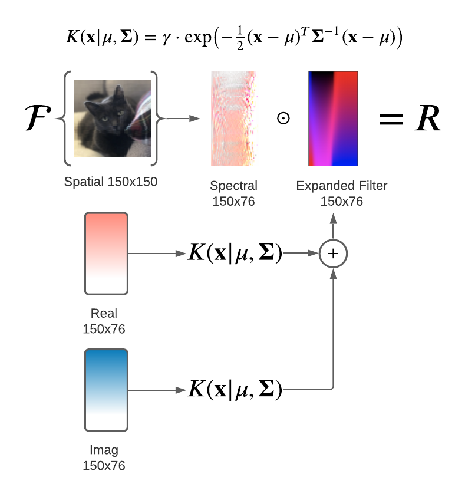

# spectral-neural-nets

spectral-neural-nets is a Keras implementation of <a href="https://lukewood.dev/pdf/spectral-conv.pdf">Parametric Spectral Filters for Fast Converging, Scalable Convolutional Neural Networks<a/>.  Published at ICASSP 2021.
  
bibtex:
```
@INPROCEEDINGS{9414587,
author={Wood, Luke and Larson, Eric C.},
booktitle={ICASSP 2021 - 2021 IEEE International Conference on Acoustics, Speech and Signal Processing (ICASSP)}, 
title={Parametric Spectral Filters for Fast Converging, Scalable Convolutional Neural Networks}, 
year={2021},
volume={},
number={},
pages={2800-2804},
doi={10.1109/ICASSP39728.2021.9414587}}
```
## Colab Notebooks
- [Cats vs Dogs Benchmark](https://colab.research.google.com/github/lukewood/spectral-neural-nets/blob/master/notebooks/Cats-vs-Dogs-Benchmark.ipynb)
- [Filter Visualization](https://colab.research.google.com/github/lukewood/spectral-neural-nets/blob/master/notebooks/Filter-Visualizations.ipynb)

# Overview
The center-piece of the spectral_neural_nets package is the [ParametricFourierConvolutionBase](https://github.com/LukeWood/spectral-neural-nets/blob/master/spectral_neural_nets/layers/kernel/base.py#L4).  This class performs pointwise convolution in the spectral domain for a given parametric as described in the publication.

The [ParametricFourierConvolutionBase](https://github.com/LukeWood/spectral-neural-nets/blob/master/spectral_neural_nets/layers/kernel/base.py#L4) layer expects inputs to be batches of complex image tensors.  Unfortunately, Tensorflow does not currently support automatic differentiation for `tf.einsum` when used on complex numbers.  Due to this, the [ParametricFourierConvolutionBase](https://github.com/LukeWood/spectral-neural-nets/blob/master/spectral_neural_nets/layers/kernel/base.py#L4) expects inputs to be of the shape `(None, height, width, channels, 2)`.  The final dimension is used to store the real and imaginary portions of the tensor respectively.


For convenience, `spectral_neural_nets` also provides `fft_layer`, `ifft_layer`, `from_complex`, `to_complex` to easily convert between representations.
```
from spectral_neural_nets.layers import Gaussian2DFourierLayer, fft_layer, from_complex
inputs = Input(shape=(150, 150, 3))
# shape=(150, 150, 3), dtype=tf.float32
x = fft_layer(inputs)
# shape=(150, 76, 3), dtype=tf.complex32
x = from_complex(x)
# shape=(150, 76, 3, 2), dtype=tf.float32
x = Gaussian2DFourierLayer(filters)(x)
# shape=(150, 76, 3, 2), dtype=tf.float32
x = to_complex(x)
# shape=(150, 76, 3), dtype=tf.complex32
x = ifft_layer(x)
# shape=(150, 150, 3), dtype=tf.float32
```

Fully implemented [Linear](https://github.com/LukeWood/spectral-neural-nets/blob/master/spectral_neural_nets/layers/kernel/linear.py) and [Gaussian](https://github.com/LukeWood/spectral-neural-nets/blob/master/spectral_neural_nets/layers/kernel/gaussian.py) Parametric Spectral layers are included in the package.

The package also provides a fully trainable `FourierDomainConv2D` as described by [Pratt et al](http://ecmlpkdd2017.ijs.si/papers/paperID11.pdf).

## Installation
```
git clone https://github.com/lukewood/spectral-neural-nets && cd spectral-neural-nets && pip install .
```
